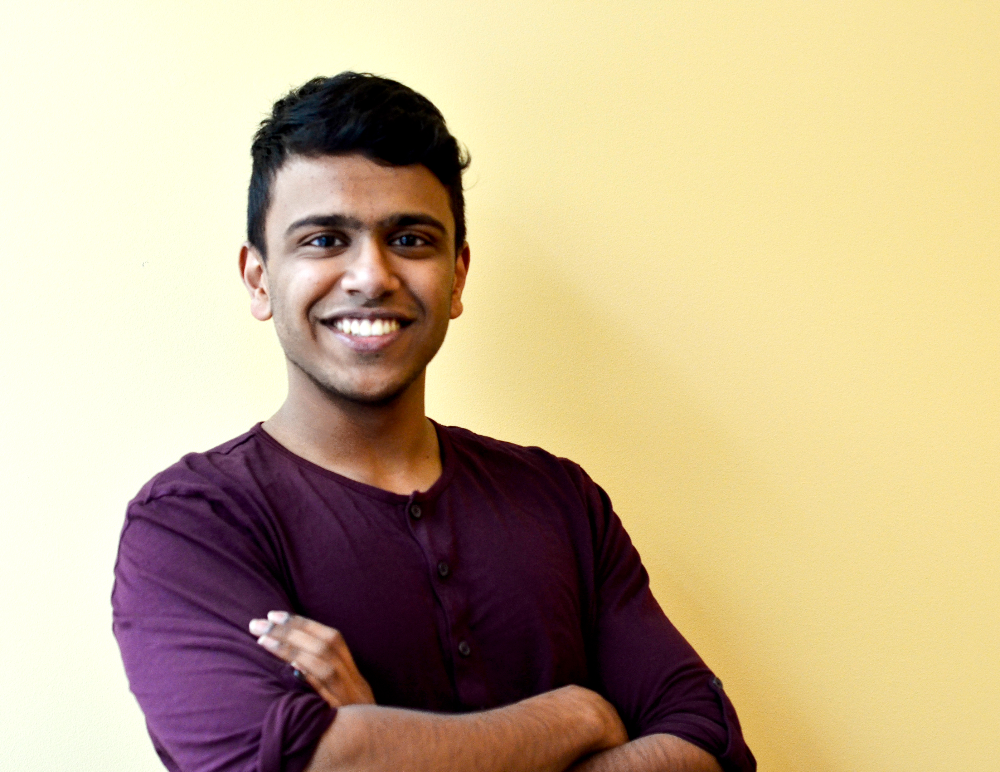
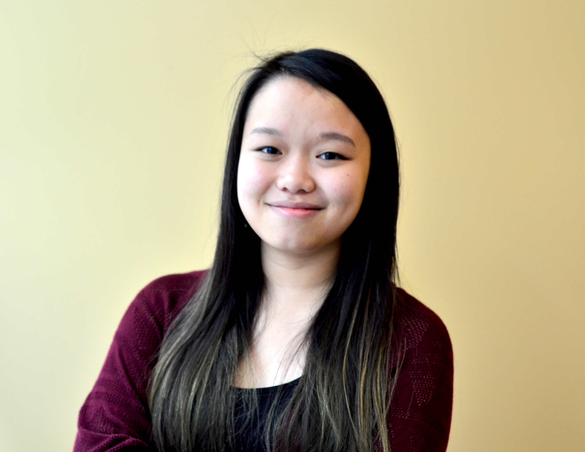
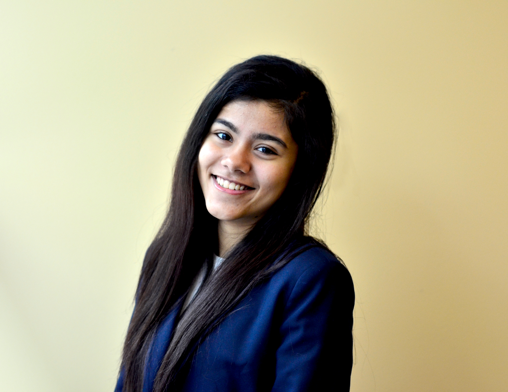
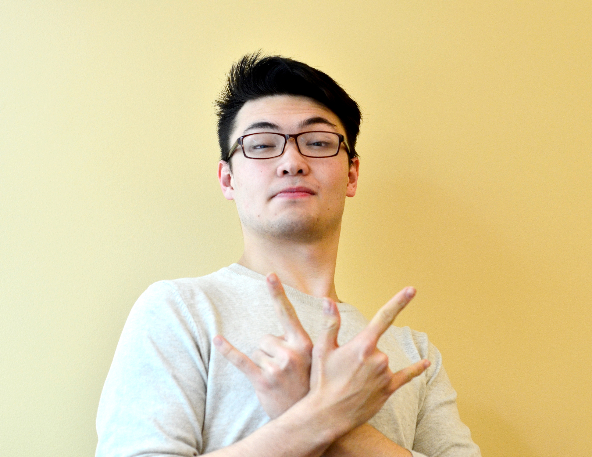
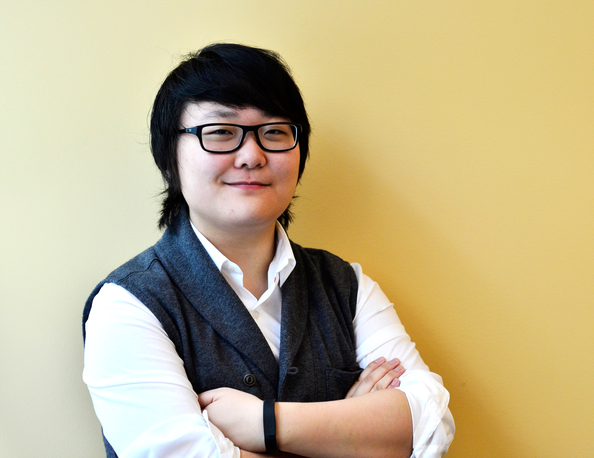
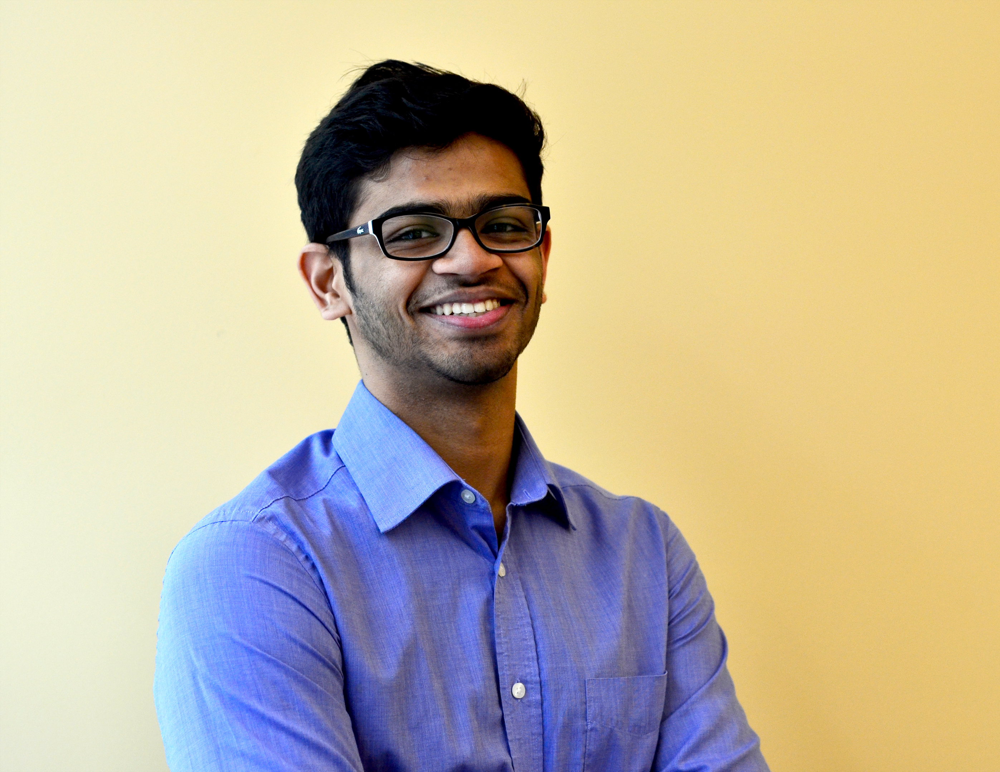

### The ams game development association

Hi there! We're AGDA , a student-run game  development team here at UBC. Every year, we get together and make new games, mixing in our collective talent and creative efforts to make a fun, engaging game that's hard to put down. Our goal is to work towards expanding our knowledge of the tools, techniques, and processes used in video game development. Speakers from the industry also come in and do Q&As. We also host an annual Vancouver game jam!

Can you code? Illustrate? Make music? Love games? Join us! We accept anyone willing to contribute. If you aren’t a pro then here’s your chance to become one: [Sign up here!](https://docs.google.com/forms/d/120_DmU-KcXTUjz_B-NMoEUqNyv2p-vMc6qTl5qvhP_0/viewform?usp=send_form)

### The Team

  

		 
     
Gowtham Mohan

     
President, Developer

		 
  

  

		 
     
Jeanie Suparman

     
Advisor, Developer

		 
  

  

		 
     
Shrey Swades Nayak

     
Treasurer, Gameplay Designer

		 
  

  

 		 
     
Jay Friso

     
Lead Gameplay Developer

		 
  

  

 	 
		
     
Max Ahn

     
Lead Gameplay Designer

		 
  

  

 	 
		
     
Ryan Crasta

     
Events &amp; Recruitment Lead

		 
  

### FAQ

**How often do you meet?**

Each team has a weekly meeting. Team leaders will also have additional short meetings with club executives to give updates/concerns. We also hold weekly jam sessions. They are optional, but it's the perfect time and environment for you to work on your game!

**What happens in club meetings?**
	
The weekly meeting will be for addressing the things  you have been up to, problems you encountered, game planning, setting up goals and milestones among yourselves, and of course making games.  Keep everyone in the circle!

**Can I join mid-semester?**

Sure! We work continuously throughout the semester and there will be some catching up to do, but if you're up for it, we'd love to have you.

**What's the developement environment?**

We mainly work with the Unity game engine, so it might be a good idea to get familiar through a few tutorials. We also use Tiled, Photoshop and Blender. We used those software last year, but we constantly found new things we can try and are better suited for certain purposes- so feel free to explore and use any software you like! 

